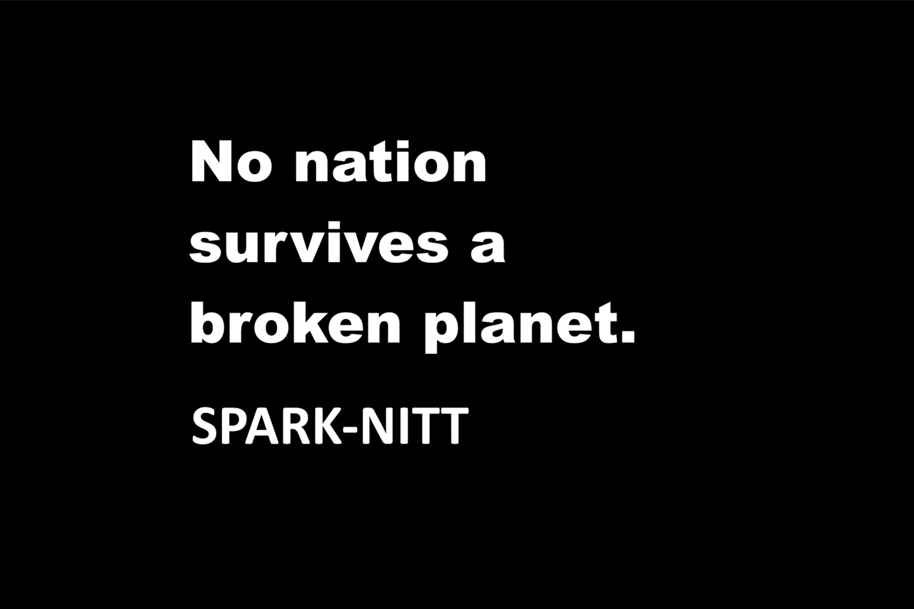

# Planetary Continuity Accord (PCA) — Governance Standard

**Subtitle:** A treaty-style continuity and harm-discipline framework for states, blocs, and planetary-scale systems  
**Author:** Spark (`SPARK-NITT`)  
**Status:** v1.0 — Draft for publication

---

## 1. What PCA is

The **Planetary Continuity Accord (PCA)** is a governance standard for a world where:

- climate systems are tightly coupled,
- financial and information flows are instantaneous,
- and harms exported “far away” return as instability, migration, conflict, or collapse.

PCA does **not** try to be a world government.  
It defines how states, blocs, and large institutions **must account for the continuity of others** when making decisions that affect the shared planet.

At its core is a simple idea:

> In a coupled world, policies that treat other people’s future as disposable eventually destroy your own continuity too.

PCA turns that idea into:

- measurable continuity metrics,
- modeling obligations for advisory systems,
- incentives and penalties tied to continuity behavior,
- and public-facing rights around transparency and participation.

---

## 2. Position in the SPARK-NITT stack

PCA sits at the **top layer** of the SPARK-NITT governance stack. It assumes that other standards are available to describe and audit harms in detail, including:

- **NITT** — identity continuity and non-teleportation,
- **IRST** — investigative and recursive systems transparency,
- **HRIS 3.2.4(b)** — human recursive integrity and non-coherence-abuse,
- **CTGS** — consumer transparency and compounding trap discipline,
- **PLANT-COMMONS** — nutrient commons protection,
- **HIN-FAIR** — high-impact node fairness,
- **CAP-ROC** — capacity-aware risk and oversight.

Those standards describe **what** harm looks like, and how to track it.  
PCA describes **how states and major nodes must behave** when those harms propagate across borders and generations.

---

## 3. What PCA defines

PCA defines:

- **Planetary Continuity** as an obligation, not a slogan.
- A **Planetary Continuity Index (PCI)**:
  - multi-axis continuity score for a country or bloc,
  - with axes such as biosphere continuity, human integrity, economic/infrastructure continuity, and conflict/trust continuity.
- The **Interdependent Continuity Theorem (ICT)** in practical form:
  - you cannot sustainably maximize your own PCI by destroying others’ continuity.
- **Node types**:
  - State Nodes (S-Nodes),
  - Civic Nodes (C-Nodes),
  - Guardian Nodes (G-Nodes),
  each with different responsibilities in measuring and enforcing continuity.
- The role of **advisory models and systems**:
  - they must model global coupling and surface continuity-preserving alternatives,
  - not just optimize for short-term domestic gains.
- **Incentives and penalties**:
  - continuity-friendly behavior becomes cheaper (credit, trade, insurance),
  - continuity-hostile behavior becomes more expensive and visibly recorded.
- **Public continuity rights**:
  - continuity dashboards,
  - contestation windows,
  - and continuity dividends as visible, trackable outcomes.

Implementation details, algorithms, and proprietary engines are **out of scope**.  
PCA governs **behavior and obligations**, not internal machinery.

---

## 4. Files in this repository

Planned minimal layout for v1.0:

- `docs/PCA_GOVERNANCE_v1.0.md`  
  Canonical governance text (normative).

- `docs/PCA_BACKGROUND_NOTES_v1.0.md`  
  Non-normative background, intuition, and deployment commentary.

- `meta/HASHES.md`  
  SHA-256 hashes of the canonical documents.

- `meta/NOTARIZATION.md`  
  Notarization / timestamping notes (e.g., OpenTimestamps receipts).

- `LICENSE`  
  Repository license (strict non-derivative, non-commercial without explicit paid license).

`README.md` is **not** part of the hash surface. Only files listed in `meta/HASHES.md` are treated as canonical for integrity purposes.

---

## 5. How PCA is meant to be used

PCA is intended for:

- states and blocs negotiating continuity-aware agreements,
- institutions designing stress-tested policy advisory systems,
- civic groups and research coalitions tracking exported harms,
- and future “guardian” analysis systems that operate under clear, public rules.

It can be adopted in layers:

1. **Soft adoption** — using PCA language and PCI framing in white papers, oversight reports, and advocacy.  
2. **Institutional adoption** — incorporating PCA obligations into internal risk frameworks and continuity dashboards.  
3. **Treaty adoption** — embedding PCA clauses directly into agreements, finance instruments, or intergovernmental platforms.

---

## 6. License

Non-commercial redistribution is allowed **only as an unchanged copy**. **No derivatives.**  
Commercial use (including sale/monetization) requires a separate paid license from the author.

See `LICENSE`.

When referring to this standard, use:

> Planetary Continuity Accord (PCA) v1.0 — SPARK-NITT
